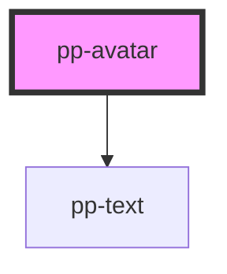

# pp-avatar

<!-- Auto Generated Below -->

## Properties

| Property | Attribute | Description | Type                                                                                                                                                | Default        |
| -------- | --------- | ----------- | --------------------------------------------------------------------------------------------------------------------------------------------------- | -------------- |
| `alt`    | `alt`     |             | `string`                                                                                                                                            | `''`           |
| `size`   | `size`    |             | `Sizes.extraLarge \| Sizes.extraLarge2 \| Sizes.extraLarge3 \| Sizes.extraSmall \| Sizes.extraSmall2 \| Sizes.large \| Sizes.medium \| Sizes.small` | `Sizes.medium` |
| `src`    | `src`     |             | `string`                                                                                                                                            | `''`           |
| `status` | `status`  |             | `"offline" \| "online"`                                                                                                                             | `'online'`     |

## Dependencies

### Depends on

- [pp-text](../pp-text)

### Graph

----------------------------------------------

*Built with [StencilJS](https://stenciljs.com/)*
