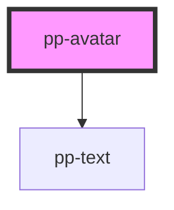

# pp-avatar

<!-- Auto Generated Below -->

## Properties

| Property     | Attribute     | Description | Type                                                                                | Default |
| ------------ | ------------- | ----------- | ----------------------------------------------------------------------------------- | ------- |
| `alt`        | `alt`         |             | `string`                                                                            | `''`    |
| `initialLen` | `initial-len` |             | `number`                                                                            | `3`     |
| `size`       | `size`        |             | `"2xl" \| "2xs" \| "3xl" \| "3xs" \| "4xl" \| "lg" \| "md" \| "sm" \| "xl" \| "xs"` | `"md"`  |
| `src`        | `src`         |             | `string`                                                                            | `''`    |
| `status`     | `status`      |             | `"" \| "offline" \| "online"`                                                       | `''`    |

## Dependencies

### Depends on

- [pp-text](../pp-text)

### Graph

----------------------------------------------

*Built with [StencilJS](https://stenciljs.com/)*
