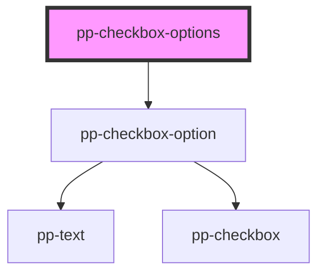

# pp-checkbox

<!-- Auto Generated Below -->

## Properties

| Property  | Attribute | Description | Type            | Default     |
| --------- | --------- | ----------- | --------------- | ----------- |
| `name`    | `name`    |             | `string`        | `undefined` |
| `options` | --        |             | `OptionShape[]` | `[]`        |
| `value`   | --        |             | `any[]`         | `[]`        |

## Events

| Event              | Description | Type               |
| ------------------ | ----------- | ------------------ |
| `listOptionChange` |             | `CustomEvent<any>` |

## Dependencies

### Depends on

- [pp-checkbox-option](.)

### Graph

----------------------------------------------

*Built with [StencilJS](https://stenciljs.com/)*
