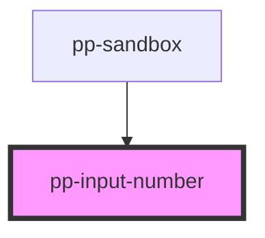

# pp-input-number

<!-- Auto Generated Below -->

## Properties

| Property              | Attribute               | Description | Type                  | Default     |
| --------------------- | ----------------------- | ----------- | --------------------- | ----------- |
| `name`                | `name`                  |             | `string`              | `undefined` |
| `numeralDecimalScale` | `numeral-decimal-scale` |             | `number`              | `undefined` |
| `options`             | --                      |             | `IInputNumberOptions` | `undefined` |
| `prefixValue`         | `prefix-value`          |             | `string`              | `''`        |
| `value`               | `value`                 |             | `string`              | `undefined` |

## Events

| Event               | Description | Type               |
| ------------------- | ----------- | ------------------ |
| `inputNumberChange` |             | `CustomEvent<any>` |

## Shadow Parts

| Part                | Description |
| ------------------- | ----------- |
| `"pp-input-number"` |             |

## Dependencies

### Used by

 - [pp-sandbox](../..)

### Graph

----------------------------------------------

*Built with [StencilJS](https://stenciljs.com/)*
