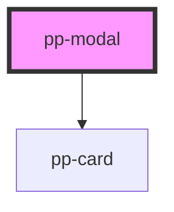

# pp-modal

<!-- Auto Generated Below -->

## Properties

| Property            | Attribute             | Description | Type                     | Default     |
| ------------------- | --------------------- | ----------- | ------------------------ | ----------- |
| `attachCloseAction` | `attach-close-action` |             | `boolean`                | `false`     |
| `gutter`            | `gutter`              |             | `boolean`                | `undefined` |
| `open`              | `open`                |             | `boolean`                | `false`     |
| `portal`            | `portal`              |             | `HTMLElement \| boolean` | `null`      |

## Events

| Event           | Description | Type               |
| --------------- | ----------- | ------------------ |
| `backdropClick` |             | `CustomEvent<any>` |
| `modalClose`    |             | `CustomEvent<any>` |
| `modalLoad`     |             | `CustomEvent<any>` |
| `modalOpen`     |             | `CustomEvent<any>` |

## Dependencies

### Depends on

- [pp-card](../pp-card)

### Graph

----------------------------------------------

*Built with [StencilJS](https://stenciljs.com/)*
