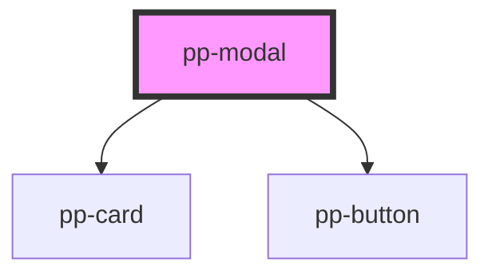

# pp-modal

<!-- Auto Generated Below -->

## Properties

| Property            | Attribute             | Description | Type      | Default |
| ------------------- | --------------------- | ----------- | --------- | ------- |
| `attachCloseAction` | `attach-close-action` |             | `boolean` | `false` |
| `open`              | `open`                |             | `boolean` | `false` |

## Events

| Event        | Description | Type               |
| ------------ | ----------- | ------------------ |
| `modalClose` |             | `CustomEvent<any>` |
| `modalOpen`  |             | `CustomEvent<any>` |

## Shadow Parts

| Part                | Description |
| ------------------- | ----------- |
| `"pp-modal-dialog"` |             |

## Dependencies

### Depends on

- [pp-card](../pp-card)
- [pp-button](../pp-button)

### Graph

----------------------------------------------

*Built with [StencilJS](https://stenciljs.com/)*
