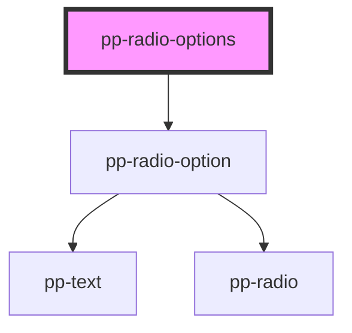

# pp-radio

<!-- Auto Generated Below -->

## Properties

| Property  | Attribute | Description | Type            | Default     |
| --------- | --------- | ----------- | --------------- | ----------- |
| `name`    | `name`    |             | `string`        | `undefined` |
| `options` | --        |             | `OptionShape[]` | `[]`        |
| `value`   | `value`   |             | `any`           | `undefined` |

## Events

| Event          | Description | Type               |
| -------------- | ----------- | ------------------ |
| `optionChange` |             | `CustomEvent<any>` |

## Dependencies

### Depends on

- [pp-radio-option](.)

### Graph

----------------------------------------------

*Built with [StencilJS](https://stenciljs.com/)*
