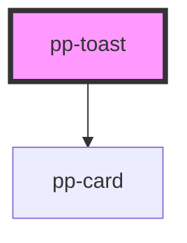

# pp-toast

<!-- Auto Generated Below -->

## Properties

| Property   | Attribute  | Description | Type      | Default    |
| ---------- | ---------- | ----------- | --------- | ---------- |
| `open`     | `open`     |             | `boolean` | `false`    |
| `position` | `position` |             | `string`  | `'bottom'` |

## Dependencies

### Depends on

- [pp-card](../pp-card)

### Graph

----------------------------------------------

*Built with [StencilJS](https://stenciljs.com/)*
