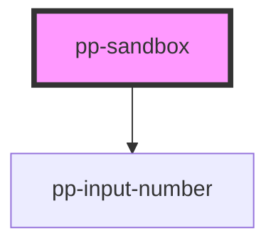

# pp-sandbox

<!-- Auto Generated Below -->

## Properties

| Property | Attribute | Description | Type     | Default |
| -------- | --------- | ----------- | -------- | ------- |
| `val`    | `val`     |             | `string` | `''`    |

## Dependencies

### Depends on

- [pp-input-number](./components/pp-input)

### Graph

----------------------------------------------

*Built with [StencilJS](https://stenciljs.com/)*
